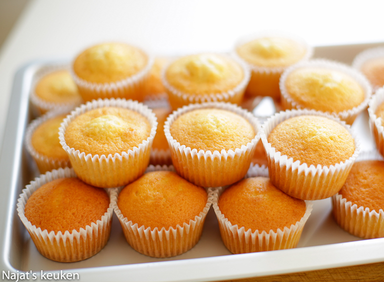

# Lekker muffin

## Benodigheden

* 3 eieren
* 140 g kristalsuiker
* 8 g vanillesuiker
* 0.2 g zout

### Bereiding

1. Klop de eieren, suiker, vanillesuiker en zout voor [timer length=5]5 minuten[/timer] op. Voeg de zonnebloemolie, bloem, bakpoeder en melk toe. Mix samen tot een geheel.

2. Plaats de cupcake papiertjes in een muffin bakplaat en vul ze voor tweederde met het beslag (28 tot 30 gr beslag per cupcake).

3. Leg het in een voorverwarmde oven op 175 ℃ voor zo’n [timer length=20]20[/timer] tot [timer length=30]30 minuten[/timer].

a [kookmutsjes.com](https://kookmutsjes.com/recept/basisrecept-cupcakes/).